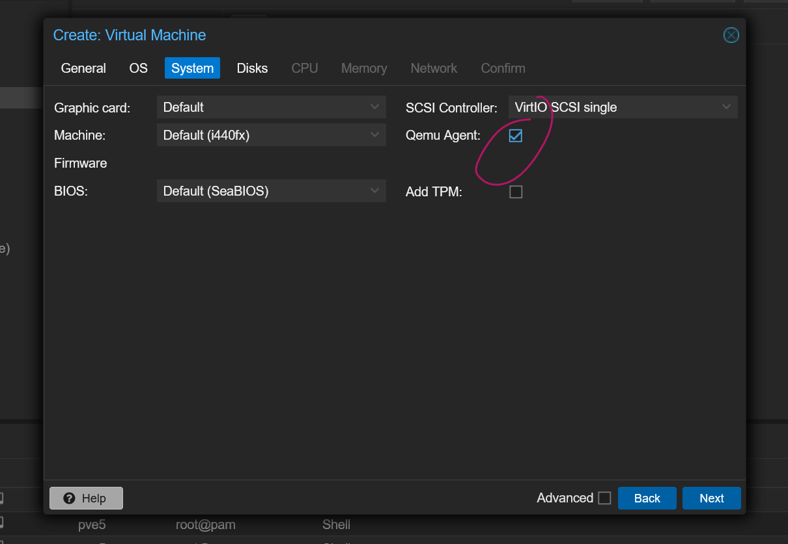

# Setting Up Ubuntu minimal desktop vms in Proxmox <!-- omit in toc -->

- [Setting Up Vm in Proxmox](#setting-up-vm-in-proxmox)
- [Using Using Preconfigured template](#using-using-preconfigured-template)
- [Configuring Ubuntu Installation inside VM](#configuring-ubuntu-installation-inside-vm)
- [Extra + Questions](#extra--questions)

## Setting Up Vm in Proxmox
+ This is similar to setting up any vm in proxmox
+ Note: There is an Ubuntu Template you can pull from if you want to create additional VMs. If you are pulling from this template you can avoid [Configuring Ubuntu Install inside Vm](#configuring-ubuntu-installation-inside-vm) step and skip straight to the [Using Preconfigured template](#using-using-preconfigured-template) step.

1. Hit Create VM - blue button in top right
2. Ensure the node is PVE4(this is a design choice specific to our system, our linux VMs are under PVE4) & hit next (Please note that this is subject to change, px1 as of now. Use the currently available node and VM ID.)
   1. Keep all Linux machines on the same instance to improve network performance

3. OS - Choose "Use CD/DVD disc image..
   - Storage: "ccdc2024Storage" - This is where our iso files are stored
   - Iso Image: "ubuntu-22.04.2-desktop-amd64.iso" - Iso file name
   - Type: "Linux"
   - Version: "6.x - 2.6 Kernel"
   - Hit "Next" - bottom left blue button

4. System - Keep as Default
   - Be sure to select "Qemu Agent"
    
5. Disk
   - Storage : "ccdc2024Storage"
   - Disk Size: "32" - minimal installation requires 8.6gb - You may want to reduce disk size to save space
   - Format : "QEMU image format"
   - Keep the rest set to the default options
6. CPU - Your choice
   - Our System : Kept as default
   - Every value  = 1
   - Type : "x86-64-v2-AES"

7. Memory
   - 2048

8. Network
   - Bridge :"Vmbr0"
     - This is subject to change as we segment our infrastructure. Vmbr0 is the only one with external internet access currently

9. Confirm settings
   - Self-explanatory

## Using Using Preconfigured template
The following steps are to be completed using the proxmox web interface\

1. Right click on (Ubuntu-Desk-Template) & hit clone

   

2. Name the clone,
   1. Mode: "Full Clone"
   2. Name: Your-choice
   3. Target Storage: Make sure it is ccdc2024Storage
      1. It is preset to "Same as source", which is fine for our case

    

    4. Resource Pool: N/A

## Configuring Ubuntu Installation inside VM
The following are instructions to install the minimal Ubuntu desktop version
1. Boot into from Grub Menu
  - Select Ubuntu

        

2. Select "Install Ubuntu"
   - There should be an interface with a white ground and 2 prominent images for selection
3. Select Language & hit continue
    - English
4. Select Keyboard Language & hit continue
    - English(US)
    - on both sides select "English(US)"
5. Select minimal Installation & hit continue
    - You can select "Download updates while installing Ubuntu"
        - Our template has this option selected

    

6. Erase disk & install Ubuntu

    

7. Select drive & hit "Install now"
    - The drive number should indicate the amount of space you had allocated for the VM ie. ....32 gb ATA ...
      - Currently can't recall exactly what drive, hopefully there is only 1 drive available, since it's a VM
8. Write Changes to disk
    - Confirming what drive to write to. Just hit next after confirming the correct drive
9. Choose timezone
10. Who are you
    - Set up credentials
        - Username: "user"
        - password : Our usual password "1q.." -Check Taiga
11. **IMPORTANT**. Remember to remove iso file after installation, so the VM will not continually boot after try to reinstall every time.
12. A restart option will appear
    - Hit "Restart Now"

## Extra + Questions
Check Taiga & Important links doc
or Ask Chisom
