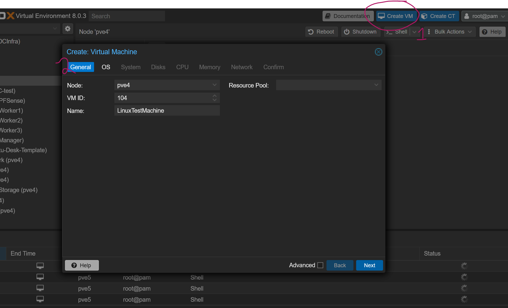
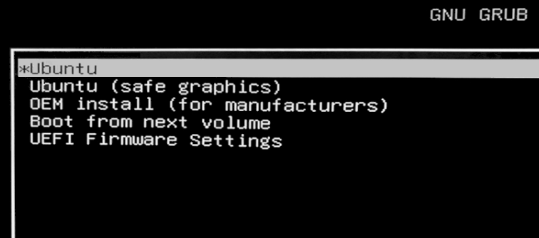

# Setting Up Ubuntu minimal desktop vms in Proxmox

- [Setting Up Ubuntu minimal desktop vms in Proxmox](#setting-up-ubuntu-minimal-desktop-vms-in-proxmox)
  - [Setting Up Vm in Proxmox](#setting-up-vm-in-proxmox)
  - [Configuring Ubuntu Installation inside VM](#configuring-ubuntu-installation-inside-vm)
  - [Extra + Questions](#extra--questions)

    

## Setting Up Vm in Proxmox
+ This is similar to setting up any VM in Proxmox
+ Note: There is an Ubuntu Template you can pull from if you want to create additional VMs. If you are pulling from this template you can avoid [Configuring Ubuntu Install inside Vm](#configuring-ubuntu-installation-inside-vm) step and skip straight to the [Using Preconfigured template] step.

1. Hit Create VM - blue button in top right
2. Ensure the node is PVE4(this is a design choice specific to our system, our linuxVms are under PVE4) & hit next

3. OS - Choose "Use CD/DVD disc image..
   * Storage: "ccdc2024Storage" - This is where our iso files are stored
   * Iso Image: "ubunut-22.04.2-desktop-amd64.iso" - Iso file name
   * Type: "Linux"
   * Version: "6.x - 2.6 Kernel"
   * Hit "Next" - bottom left blue button

4. System - Keep as Default
   * Be sure to select "Qemu Agent"
    
5. Disk - 
   * Storage : "ccdc2024Storage"
   * Disk Size: "12"
   * Format : "QEMU image format"
   * Keep the rest default
6. CPU - Your choice
   * Our System : Kept as deafault
   * Every value  = 1
   * Type : "x86-64-v2-AES"

7. Memory 
   * :2048

8. Network
   * Bridge :"Vmbr0"
     * This is subject to change as we segement our infrastructure. Vmbr0 is the only one with external internet access currently
    * We will use the SND network defined in the [Networking Documentation](./../../Network/README.md) later, these have their own requrements defined in [SDN](./../../Network/Proxmox/2-SDN.md).

9. Confirm settings
   * Self-explanatory

## Configuring Ubuntu Installation inside VM
We are now going to install Ubuntu minimal desktop

1. Boot into from Grub Menu
   * Select Ubuntu
    

2. Select "Install Ubuntu" 
   * There should be an interface with a white background and 2 prominent images for selection

3. Select Language & hit continue
    * English

4. Select Keyboard Langue & hit continue
    * English(US) 
    * On both sides select "English(US)"

5. Select minimal Installation & hit continue
    * You can select "Download updates while installing Ubuntu"
        * Our template has this option selected
    

6. Erase disk & install Ubuntu
    
    
7. Select drive & hit "Install now"
    * The drive number should indicate the amount of space you had allocated for the vm ie. ....12 gb ATA ...
      * Currently can't recall exactly what drive, hopefully there is only 1 drive available, since it's a vm
    
8. Write Changes to disk
    * Confirming what drive to write to. Just hit next after confirming the correct drive

9. Choose timezone

10.  Who are you
    * Set up credentials
        * Ours: "user"
        * pass : Our usual password "1q.." -Check Taiga

11.  Tip. Remeber to remove iso file after installation, so the vm will not continue to boot the installer after every power cycle.

12.  A restart option will appear 
    * Hit "Restart Now"

## Extra + Questions

Check Taiaga & Important links doc
or Ask Chisom
