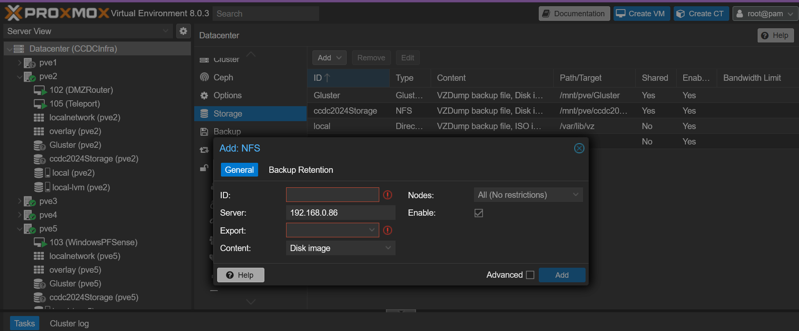

# Setting UP NFS server to connect to proxmox as a shared storage directory

**Table Of Contents**
- [Setting UP NFS server to connect to proxmox as a shared storage directory](#setting-up-nfs-server-to-connect-to-proxmox-as-a-shared-storage-directory)
  - [General Information](#general-information)
- [NFS server Machine Steps](#nfs-server-machine-steps)
  - [Setting up NFS server with an NFS share (directory)](#setting-up-nfs-server-with-an-nfs-share-directory)
- [Client Machine Steps](#client-machine-steps)
  - [Creating and Linking directories](#creating-and-linking-directories)
- [Extra - Ensuring Proxmox recognizes the cluster storage](#extra---ensuring-proxmox-recognizes-the-cluster-storage)
- [Questions:](#questions)


## General Information
|  IP | Name  |
|---|---|
|  192.168.0.86 | NFS server  |

** Note: This is assuming that there is storage already set up on xoa(which I don't have access to) or some external vm 

# NFS server Machine Steps

## Setting up NFS server with an NFS share (directory)
This directory will be our shared storage where every file, exe, etc is stored.

1. Install NFS Kernel 
  ```sh 
   sudo apt install nfs-kernel-server
  ```
2. Create Root Directory
  ```sh
    sudo mkdir /mnt/ccdc2024Storage #This can be any directory & any name, but must be consistent through this section of the documention
  ```
3. Set Permissions -
  - Allows any user on the client machines to access and edit the shared directory.
  - Applies to VM stored on the directory
  ```sh
  sudo chown nobody:nogroup /mnt/ccdc2024Storage #no-one is the owner

  sudo chmod 777 /mnt/ccdc2024Storage #everyone can modify files
  ```
4. Edit the Export File - Once again modifying permission
  - Add the following line to the "/etc/exports" file
  ```sh
  mnt/ccdc2024Storage 192.168.0.0/24 (rw,sync,no_subtree_check)
  ```
    - This allows access to the entire subnet for our infrastructure

1. Run the following commands to "export" our shared directory to potential machines & restart NFS(required)
  ```sh
  sudo exportfs
  sudo systemctl restart nfs-kernel-server #restarting the NFS kernel
  ```


# Client Machine Steps 
- aka PVE nodes for proxmox

## Creating and Linking directories
1. Create shared directory that we will mount our NFS  storage to
  ```sh
  sudo mkdir /mnt/ccdc2024Storage #This can be any directory & any name, but must be consistent through this section of the documentation
  ```
2. Edit the FStab file
  - Place tabs inbetween each segment, **not spaces**
  - For some reason with our proxmox, you if you use a text editor it will not work, so the **cat command is need** to input the the text
  ```sh
  cat 192.186.0.86/mnt/ccdc2024Storage /mnt/ccdc2024Storage    nfs defaults    0   0 >> /etc/fstab
  ```
  - ex. {IP of NFS server}:{folder path on server} /var/local-PVEnode-mount
  
3. mount the directories
  ``` sh
  mount /mnt/ccdc2024Storage #local mount

  mount 192.186.0.86/mnt/ccdc2024Storage #NFS global share
  ```
4. Restart the client machines


# Extra - Ensuring Proxmox recognizes the cluster storage
 - Unsure if this matters, but it doesn't hurt
1. Withing Proxmox, Navigate to the cluster
2. Select Storage
   1. Add: NFS
   2. Type in ID: "Any name for shared storage:
   3. Server: Ip of NFS server
   4. The exported directory we made in the [Setting up NFS server with an NFS share(directory)](#setting-up-nfs-server-with-an-nfs-sharedirectory)
   
3. Hit "Add"


# Questions:
- Ask Chisom...
